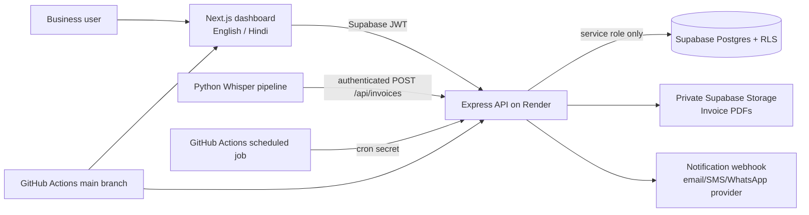

<<<<<<< HEAD
# VYAPAARSAATHI.AI
=======
# VyapaarSathi AI

VyapaarSathi AI is a secure, bilingual business-operations suite for Indian small businesses. It turns routine work—GST invoice generation, UPI CSV reconciliation, compliance reminders, and spoken invoice capture—into a single workflow.

## Value proposition

Small businesses often maintain invoices, UPI payments, and GST dates across paper, spreadsheets, and chat messages. VyapaarSathi AI creates GST-inclusive invoices at 18%, securely reconciles imported UPI statements, warns users three days before a GST filing date, and converts a voice note into a reviewable invoice request.

## Architecture



The browser never receives the Supabase service-role key. It only receives a signed, ten-minute PDF URL after the API validates invoice ownership.

## Repository layout

```text
backend/                 Express API, Zod validation, PDF generation and reconciliation
frontend/                Next.js App Router dashboard with Tailwind and i18next
voice/                   Whisper transcription and voice-to-invoice script
supabase/migrations/     Schema, RLS, indexes, and private PDF bucket migration
.github/workflows/       validation, Vercel/Render deployment, and GST reminder dispatch
```

## Prerequisites

- Node.js 20+
- Python 3.11+
- A Supabase project with Email/password or another supported Auth provider enabled
- Vercel project for `frontend/` and Render Web Service for `backend/`

## Local setup

1. Create a Supabase project, then apply migrations in order:

   ```bash
   supabase link --project-ref YOUR_PROJECT_REF
   supabase db push
   ```

   The first migration creates all tables, indexes, RLS policies, automatic user-profile provisioning, and cross-tenant ownership guards. The second creates a private `invoice-pdfs` bucket.

2. Configure and run the API:

   ```bash
   cp backend/.env.example backend/.env
   npm install
   npm run dev --workspace=@vyapaarsathi/api
   ```

3. Configure and run the dashboard in another terminal:

   ```bash
   cp frontend/.env.example frontend/.env.local
   npm run dev --workspace=@vyapaarsathi/web
   ```

4. Optionally configure voice invoices:

   ```bash
   python -m venv .venv
   . .venv/bin/activate # Windows PowerShell: .venv\Scripts\Activate.ps1
   pip install -r voice/requirements.txt
   # Set the variables in voice/.env.example in your shell; do not commit them.
   python voice/voice_to_invoice.py ./sample.m4a --dry-run
   ```

## Environment variables

| Location | Required variables |
| --- | --- |
| `backend/.env` | `SUPABASE_URL`, `SUPABASE_SERVICE_ROLE_KEY`, `CRON_SECRET` (32+ characters), `FRONTEND_ORIGIN`, `SUPABASE_INVOICE_BUCKET` |
| `frontend/.env.local` | `NEXT_PUBLIC_API_URL`, `NEXT_PUBLIC_SUPABASE_URL`, `NEXT_PUBLIC_SUPABASE_ANON_KEY` |
| `voice` shell | `OPENAI_API_KEY`, `VYAPAARSATHI_API_URL`, `SUPABASE_ACCESS_TOKEN` |
| GitHub secrets | `VERCEL_TOKEN`, `VERCEL_ORG_ID`, `VERCEL_PROJECT_ID`, `RENDER_DEPLOY_HOOK_URL`, `API_BASE_URL`, `CRON_SECRET` |

Never expose `SUPABASE_SERVICE_ROLE_KEY`, `CRON_SECRET`, OpenAI keys, or a user access token in frontend variables, logs, or Git.

## API surface

All browser-facing routes require `Authorization: Bearer <Supabase access token>`.

| Method | Route | Purpose |
| --- | --- | --- |
| `GET` / `POST` | `/api/invoices` | List or create a GST 18% invoice and private PDF |
| `GET` | `/api/invoices/:id/pdf` | Return a 10-minute signed PDF URL |
| `POST` | `/api/gst/reminders` | Schedule a filing reminder three days before the due date |
| `POST` | `/api/gst/cron` | Dispatch due reminders; requires `x-cron-secret` |
| `POST` | `/api/upi/import` | Import one UTF-8 CSV (`file` form field, max 5 MB / 500 rows) |
| `POST` | `/api/upi/reconcile` | Score unmatched UPI transactions against outstanding invoices |
| `GET` | `/api/upi/transactions` | List recent imported transactions |

## Sample request schemas

```json
// POST /api/invoices
{
  "customerName": "Meera Traders",
  "invoiceDate": "2026-07-25",
  "dueDate": "2026-08-01",
  "lineItems": [
    { "description": "Monthly inventory service", "quantity": 1, "unitPricePaise": 250000 }
  ]
}
```

```csv
Transaction ID,Amount,Direction,Transaction Date,Payer Name,Payer UPI ID
UPI-20260725-001,"2,950.00",credit,2026-07-25T10:30:00Z,Meera Traders,meera@upi
```

`invoices` stores monetary values as integer paise. PostgreSQL generated columns calculate `gst_amount_paise` and `total_paise`; the API does not trust client-calculated totals. `transactions.normalized_transaction_id` is indexed with `pg_trgm` for fuzzy-ID workflows, and duplicate normalized IDs are rejected per tenant.

## Deployment

1. In Vercel, set the project root directory to `frontend` and copy the frontend variables.
2. In Render, create the service from `render.yaml`, add the secret backend variables, and set `FRONTEND_ORIGIN` to the Vercel deployment URL.
3. Add the GitHub secrets listed above. Pushes to `main` type-check, deploy Vercel, then trigger Render.
4. The workflow sends the protected reminder trigger at 09:00 IST. Set `API_BASE_URL` to the Render public URL without a trailing slash.

## Security and operational notes

- Supabase RLS confines every business row to `auth.uid()`; additional database triggers reject invoice relations that cross tenants.
- The backend validates JWTs with Supabase Auth before every protected operation and rate-limits the public API.
- CSV parsing is memory-capped, limits rows and record size, sanitizes filenames, returns row-level validation errors, and flags future timestamps.
- PDF storage is private. The API rolls back the invoice record if PDF upload fails; production monitoring should alert on any failed storage/database update for orphan cleanup.
- Fuzzy reconciliation auto-matches only high-confidence, unambiguous candidates. Medium-confidence results remain in `review` for a human.
- Configure a real notification webhook before selecting external reminder channels. `in_app` reminders are safe without one.

## Validation

```bash
npm run check
python -m compileall -q voice/voice_to_invoice.py
```

Commit the generated `package-lock.json` after the first `npm install`; then replace CI's `npm install` commands with `npm ci` for fully locked dependency builds.
>>>>>>> 7703cb2 (Initial VyapaarSathi AI release)
